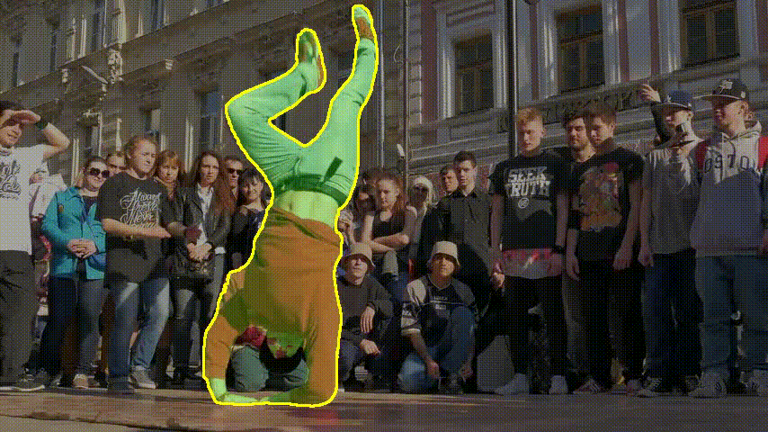
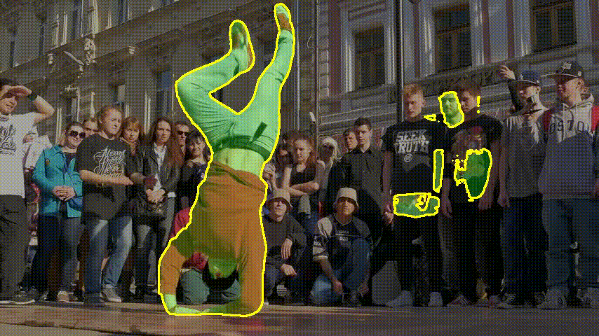
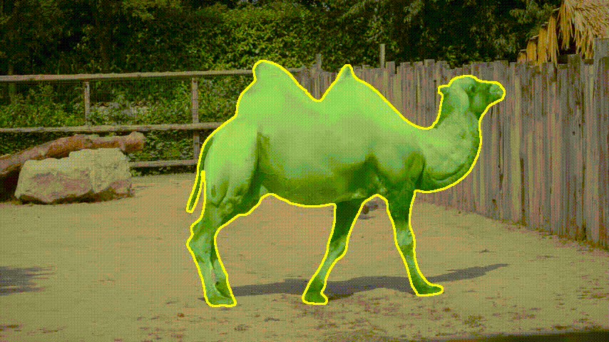
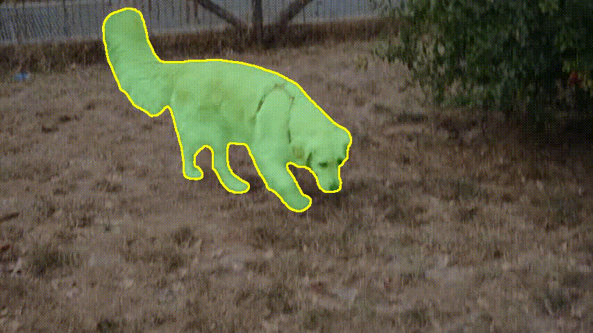
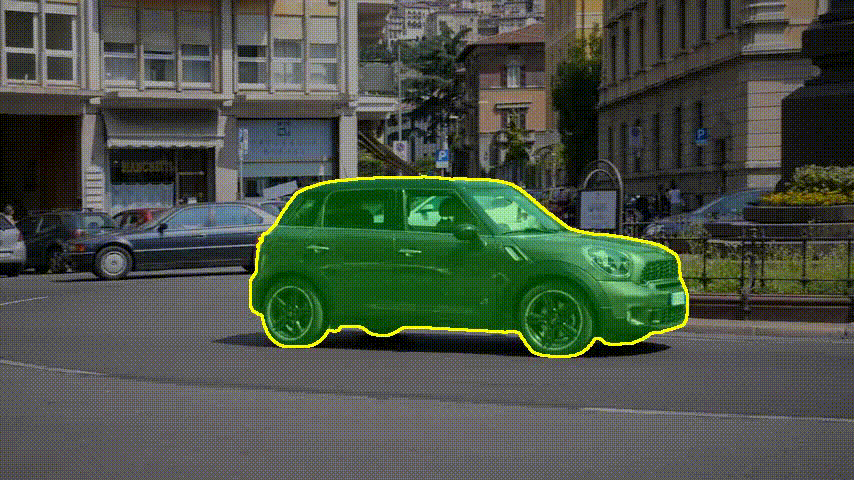

# StyleKAN: Salient Object Detection via Stylized Fusion and KAN Decoding

> **Anonymous ECCV Submission**  
> This repository contains the training and evaluation code for StyleKAN, our image-only saliency model that generalizes to VSOD benchmarks without any video supervision.

---

## 1. Environment Setup

We recommend Python 3.10+ and CUDA 11.8+. Also clone the dinov3 from github. and place it in the directory where your codes are present.

```bash
pyenv install 3.10.13

# create a virtual environment
pyenv virtualenv 3.10.13 stylekan

# activate the environment
pyenv activate stylekan

# install PyTorch compatible with CUDA 11.8
pip install torch torchvision torchaudio --index-url https://download.pytorch.org/whl/cu118

# install other dependencies
pip install -r requirements.txt
```

## 2. Training and Evaluation

We train our model just of DUTS-Training datasets to save the checkpoints you use the DUTS-TE to evaluate and save the best checkpoint.

```
data_path/
└── DUTS/
    ├── train/
    │   ├── image/
    │   │   ├── 0001.jpg
    │   │   ├── 0002.jpg
    │   │   └── ...
    │   └── mask/
    │       ├── 0001.png
    │       ├── 0002.png
    │       └── ...
    └── test/
        ├── image/
        │   ├── 0001.jpg
        │   ├── 0002.jpg
        │   └── ...
        └── mask/
            ├── 0001.png
            ├── 0002.png
            └── ...
```
```bash
# This is the training for the model.
python3 train.py

# Once the checkpoint is saved in ./runs test it for the setting the datapaeth for Video based datasets and for the Image based datasets using the saved checkpoint.

python3 test_image.py # for image based datasets
python3 test_vsod.py # for video based datasets
```

## 3. Qualitative Analysis

The following qualitative comparisons show the **ground truth segmentation overlays** and **StyleKAN predictions** on several DAVIS sequences.

---

### Breakdance Sequence

| Ground Truth | StyleKAN Prediction |
|--------------|--------------------|
|  |  |

---

### Camel Sequence

| Ground Truth | StyleKAN Prediction |
|--------------|--------------------|
|  |  |

---

### Dog Sequence

| Ground Truth | StyleKAN Prediction |
|--------------|--------------------|
|  |  |

---

### Car-Roundabout Sequence

| Ground Truth | StyleKAN Prediction |
|--------------|--------------------|
|  |  |

---

These qualitative results demonstrate that **StyleKAN produces temporally consistent and accurate object segmentation masks**, closely aligning with the ground truth annotations across challenging motion and appearance variations.
